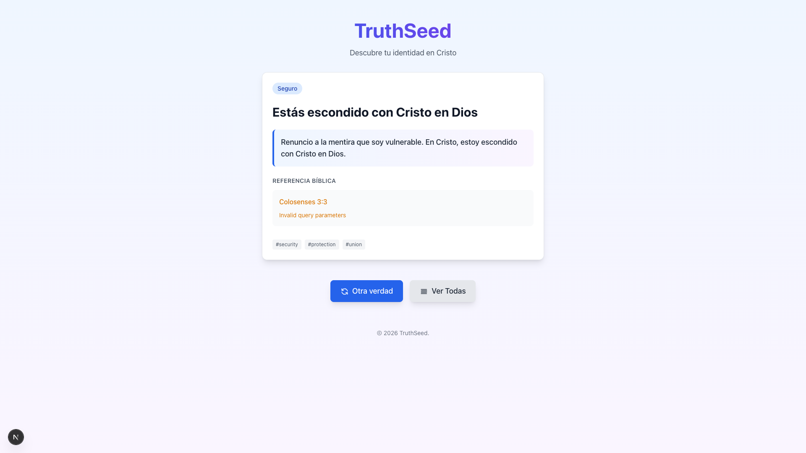

# Verse Display Fix and Translation Selector

**ADW ID:** 14
**Date:** 2026-02-13
**Specification:** specs/issue-14-adw-8ce63913-bug-fix-verse-display-params.md

## Overview

Fixed critical bugs preventing Bible verse display and added user-selectable translation feature. The implementation resolves parameter validation errors when fetching verses, handles API response format variations, and provides a UI component for users to choose their preferred Bible translation with localStorage persistence.

## Screenshots




## What Was Built

- **API Parameter Validation Fix**: Corrected null handling for optional `verseEnd` parameter in verse API route
- **API Response Format Support**: Updated Bible API client to handle both single object and array responses
- **Translation Storage Utility**: Created localStorage-based translation preference management
- **Translation Selector Component**: Built dropdown UI for selecting from 6 supported Bible translations
- **Dynamic Translation Switching**: Integrated selector into TruthCard with automatic verse re-fetching on translation change

## Technical Implementation

### Files Modified

- `src/app/api/verse/route.ts`: Fixed parameter validation by converting null to undefined for optional verseEnd parameter
- `src/lib/bible-api-client.ts`: Updated response parsing to handle both single object and array formats from API (17 lines modified)
- `src/components/TruthCard.tsx`: Integrated translation selector with dynamic translation switching and re-fetching logic (21 lines modified)
- `src/content/truths.json`: Updated all 34 Bible references from "RVR60" to supported "rv1960" translation code (68 lines modified)

### Files Created

- `src/components/TranslationSelector.tsx`: New dropdown component for translation selection with localStorage persistence (71 lines)
- `src/lib/translation-storage.ts`: Translation preference storage utility with TypeScript types and validation (63 lines)

### Key Changes

- **Null to Undefined Conversion**: Changed `searchParams.get('verseEnd')` to `searchParams.get('verseEnd') ?? undefined` to match Zod schema expectations
- **API Response Normalization**: Added logic to handle both single verse object responses and verse range array responses from docs-bible-api
- **Translation State Management**: Implemented React state and localStorage integration to persist user's translation preference across sessions
- **Automatic Re-fetching**: When translation changes, verses automatically re-fetch using the new translation code
- **Type-Safe Translation Codes**: Created `Translation` union type with all 6 supported translations: rv1960, rv1995, nvi, dhh, pdt, kjv

## How to Use

### Selecting a Translation

1. Navigate to any truth in the TruthSeed application
2. Look for the "Traducción:" dropdown in the upper-right section of the verse display
3. Click the dropdown to see all 6 supported translations:
   - Reina-Valera 1960 (RVR60)
   - Reina-Valera 1995 (RVR95)
   - Nueva Versión Internacional (NVI)
   - Dios Habla Hoy (DHH)
   - Palabra de Dios para Todos (PDT)
   - King James Version (KJV)
4. Select your preferred translation
5. The verse will automatically re-fetch and display in the selected translation
6. Your preference is saved to localStorage and persists across sessions

### For Developers

**Reading Translation Preference:**

```typescript
import { getTranslation } from '@/lib/translation-storage';

const currentTranslation = getTranslation(); // Returns 'rv1960' by default
```

**Setting Translation Preference:**

```typescript
import { setTranslation } from '@/lib/translation-storage';

setTranslation('nvi'); // Saves to localStorage
```

**Using TranslationSelector Component:**

```typescript
import { TranslationSelector } from '@/components/TranslationSelector';

<TranslationSelector
  onChange={(translation) => {
    console.log('Translation changed to:', translation);
    // Handle translation change
  }}
/>
```

## Configuration

### Supported Translations

The following translations are supported by the docs-bible-api:

- `rv1960` - Reina-Valera 1960 (traditional Spanish)
- `rv1995` - Reina-Valera 1995
- `nvi` - Nueva Versión Internacional (modern Spanish)
- `dhh` - Dios Habla Hoy
- `pdt` - Palabra de Dios para Todos
- `kjv` - King James Version (English)

### localStorage Key

Translation preference is stored under: `truthseed:bible:translation`

### Default Translation

If no preference is saved, the application defaults to `rv1960` (Reina-Valera 1960).

## Testing

### Manual Testing

1. **Test Parameter Validation Fix:**
   - Load any truth with a single verse reference (without verseEnd)
   - Verify no "Invalid params" error appears
   - Check that the verse loads successfully

2. **Test Translation Selector:**
   - Open the application and navigate to any truth
   - Change translation using the dropdown
   - Verify verse text updates immediately
   - Refresh the page and verify translation preference persists

3. **Test API Response Handling:**
   - Load a single verse reference (e.g., John 3:16)
   - Load a verse range reference (e.g., Romans 8:28-30)
   - Verify both display correctly

### E2E Testing

Run the E2E test suite to validate verse display functionality:

```bash
cd app && pnpm test:e2e
```

Tests validate:

- Translation selector is visible and functional
- All 6 translations can be selected
- Verse text changes when translation is switched
- Translation preference persists across page reloads
- No console errors during translation switching

## Notes

### API Response Format Variations

The docs-bible-api returns different response formats:

- **Single verse**: Returns a single object `{ verse: "...", book: "...", chapter: "...", id: "..." }`
- **Verse range**: Returns an array of objects `[{ verse: "...", ... }, { verse: "...", ... }]`

The Bible API client normalizes both formats into an array for consistent processing.

### Translation Code Migration

All references in `truths.json` were updated from "RVR60" to "rv1960" to match the docs-bible-api supported translation codes. The application now uses lowercase translation codes consistently.

### Future Enhancements

- Add translation comparison view (side-by-side verses in different translations)
- Display translation abbreviation alongside verse references
- Add tooltips explaining differences between translations
- Support per-truth translation overrides (while maintaining global preference)
