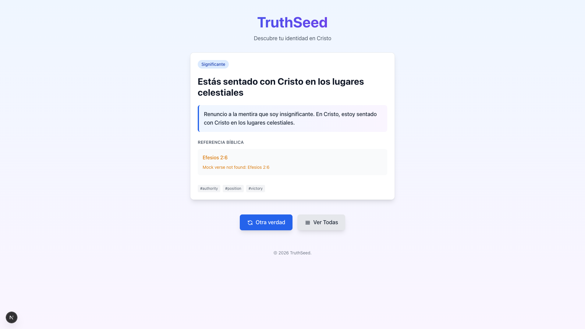

# Bible API Integration for Real Verse Display

**ADW ID:** c5c51e28
**Date:** 2026-02-12
**Specification:** specs/issue-10-adw-c5c51e28-sdlc_planner-integrate-bible-api.md

## Overview

The TruthSeed PWA now integrates with scripture.api.bible to fetch and display real biblical verse texts in Spanish (RVR60 translation). Previously, the application displayed mock messages like "Mock verse not found" for biblical references. This integration provides users with complete, accurate Bible verses for each truth, enhancing the app's value by allowing users to read the full scriptural foundation for biblical truths about their identity in Christ. The implementation includes intelligent caching, graceful fallback to mock data when the API is unavailable, and comprehensive error handling.

## Screenshots




## What Was Built

- **Bible API Client** (`src/lib/bible-api-client.ts`): HTTP client for scripture.api.bible with authentication, retry logic, timeout handling, and comprehensive error handling
- **Verse Parser** (`src/lib/verse-parser.ts`): Utility to parse Spanish biblical references and convert book names to API-compatible IDs (e.g., "Mateo" → "MAT", "1 Juan" → "1JN")
- **Provider Factory** (`src/lib/bible-provider-factory.ts`): Factory pattern to select between BibleApiProvider and MockBibleProvider based on environment configuration
- **Enhanced API Route** (`src/app/api/verse/route.ts`): Updated verse endpoint to fetch real verses with fallback to mock data
- **Comprehensive Unit Tests**: 719 lines of tests for bible-api-client and 430 lines for verse-parser
- **E2E Test**: New E2E test to validate end-to-end verse fetching and display
- **Updated Documentation**: Enhanced README.md and .env.sample with Bible API setup instructions

## Technical Implementation

### Files Modified

- `src/app/api/verse/route.ts`: Replaced mock implementation with real BibleApiClient calls, added fallback to MockBibleProvider, implemented proper cache headers (7-day duration)
- `src/components/TruthCard.tsx`: Minor update to ensure compatibility with the provider factory pattern
- `README.md`: Added comprehensive Bible API configuration section with step-by-step setup instructions and troubleshooting guide
- `.env.sample`: Enhanced with detailed Bible API environment variable documentation and examples

### Files Created

- `src/lib/bible-api-client.ts`: 241 lines implementing HTTP client with timeout (10s), retry logic (1 retry for 5xx errors), HTML content cleaning, and comprehensive error handling
- `src/lib/verse-parser.ts`: 192 lines implementing Spanish-to-API book name mapping for all 66 Bible books, including numbered books (1 Juan, 2 Corintios) and accented names (Génesis, Éxodo)
- `src/lib/bible-provider-factory.ts`: 74 lines implementing factory pattern to select provider based on environment configuration
- `tests/unit/bible-api-client.test.ts`: 719 lines of comprehensive unit tests covering success cases, 404/401/429/500 errors, timeouts, retries, and HTML cleaning
- `tests/unit/verse-parser.test.ts`: 430 lines testing all 66 book names, single verses, verse ranges, invalid inputs, and edge cases
- `.claude/commands/e2e/test_bible_verse_display.md`: 48 lines defining E2E test for Bible verse display validation

### Key Changes

- **API Integration**: Integrated scripture.api.bible with RVR60 translation to fetch real verse texts, replacing mock data with actual biblical content
- **Intelligent Fallback**: Implemented graceful degradation from BibleApiProvider → MockBibleProvider when API is unavailable or not configured
- **Caching Strategy**: Server-side caching with 7-day duration (`s-maxage=604800`) and stale-while-revalidate (1 day) to minimize external API calls
- **Comprehensive Error Handling**: Proper handling of 404 (not found), 401 (invalid key), 429 (rate limit), 500+ (server errors), and network timeouts
- **HTML Content Cleaning**: API returns HTML content; implemented regex-based tag stripping to extract clean verse text
- **Retry Logic**: Automatic retry for 5xx server errors with 1-second delay, no retry for 4xx client errors

## How to Use

### For Users

1. Navigate to the TruthSeed PWA
2. View any truth displayed on the screen
3. The Bible verse reference and full text are automatically displayed below the truth statement
4. Click "Otra verdad" to see another truth with its corresponding Bible verse
5. Verses are cached locally for 7 days and work offline after first load

### For Developers

1. **Configure API Key** (optional for production use):

   ```bash
   # Register for a free API key at https://scripture.api.bible
   # Add to .env file:
   BIBLE_API_BASE_URL=https://api.scripture.api.bible/v1
   BIBLE_API_KEY=your-api-key-here
   BIBLE_DEFAULT_TRANSLATION=592420522e16049f-01  # RVR60
   ```

2. **Development Without API Key**:
   - App automatically falls back to MockBibleProvider
   - Sample verses are displayed for testing
   - Console warning indicates fallback mode

3. **Test the Integration**:
   ```bash
   pnpm test:unit  # Run unit tests
   pnpm build      # Verify production build
   pnpm dev        # Start development server
   ```

## Configuration

### Environment Variables

- **BIBLE_API_BASE_URL**: Base URL for scripture.api.bible API
  - Default: `https://api.scripture.api.bible/v1`
  - Required for real verse fetching

- **BIBLE_API_KEY**: API key for authentication
  - Obtain free key at https://scripture.api.bible
  - Required for real verse fetching

- **BIBLE_DEFAULT_TRANSLATION**: Bible translation ID
  - Default: `592420522e16049f-01` (RVR60 - Reina-Valera 1960)
  - Used when reference doesn't specify translation

### Caching Configuration

- **Server-side**: 7-day cache (`Cache-Control: public, s-maxage=604800, stale-while-revalidate=86400`)
- **Client-side**: IndexedDBCache with 7-day expiration (existing implementation)
- **Offline Support**: Cached verses remain available offline

### Provider Selection Logic

The `bible-provider-factory.ts` automatically selects the appropriate provider:

- If all environment variables are configured → `BibleApiProvider` (real API)
- If any environment variable is missing → `MockBibleProvider` (sample data with console warning)

## Testing

### Unit Tests

Run comprehensive unit tests (1,149 lines total):

```bash
pnpm test:unit
```

Tests cover:

- All 66 Bible book name conversions (Spanish → API codes)
- Numbered books (1 Juan, 2 Corintios, etc.)
- Single verses and verse ranges
- API success responses and error handling (404, 401, 429, 500, timeout)
- Retry logic for server errors
- HTML content cleaning

### E2E Tests

Run end-to-end Bible verse display test:

```bash
pnpm test:e2e
# Read .claude/commands/test_e2e.md
# Execute .claude/commands/e2e/test_bible_verse_display.md
```

E2E test validates:

- Real verse text is displayed (not mock messages)
- Verses contain Spanish biblical text
- References are properly formatted
- Multiple truths display different verses correctly

### Manual Testing

1. **With API Key**: Verify real verses from scripture.api.bible are displayed
2. **Without API Key**: Verify graceful fallback to MockBibleProvider
3. **Offline Mode**: Disconnect network, verify cached verses still display
4. **Different References**: Test various books (Genesis, Matthew, 1 John, etc.)

## Notes

### API Rate Limiting

scripture.api.bible free tier typically allows 500 requests per day. The aggressive caching strategy (7-day server-side + 7-day client-side) ensures minimal API calls:

- First request: Fetches from API
- Subsequent requests: Served from cache (server or client)
- Offline: Served from IndexedDB cache

### Supported Books

All 66 Bible books are supported with Spanish name mapping:

- Old Testament: Génesis through Malaquías (39 books)
- New Testament: Mateo through Apocalipsis (27 books)
- Special handling for numbered books (1 Juan, 2 Corintios, etc.)
- Accent variations supported (both "Génesis" and "Genesis" work)

### Error Handling

The implementation handles various error scenarios gracefully:

- **404 (Not Found)**: Book/verse doesn't exist → fallback to mock
- **401 (Unauthorized)**: Invalid API key → fallback to mock
- **429 (Rate Limit)**: Too many requests → fallback to mock
- **500+ (Server Error)**: API down → retry once → fallback to mock
- **Timeout**: Request exceeds 10s → fallback to mock
- **Network Error**: No connection → fallback to cached or mock data

All errors are logged to console for debugging but display user-friendly messages in the UI.

### Future Enhancements

Potential improvements not included in this feature:

- Support for multiple translations (NVI, TLA, etc.)
- User preference for translation selection
- Audio playback of verses
- Verse highlighting or annotation
- Search functionality across all truths
- Share verse functionality (copy to clipboard, social media)
